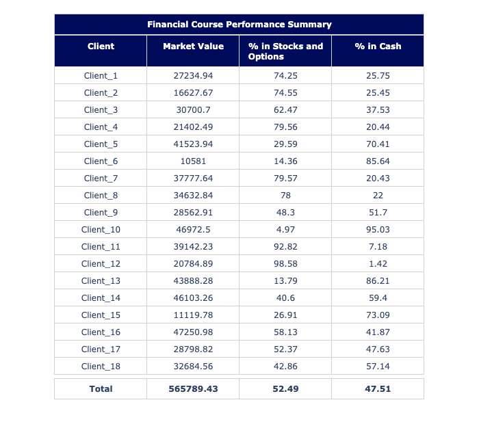

# Create Plotly Table with title and subtotals row

This project is created to enable Python users to easily generate personalized tables with custom subtotals

## Table of Contents
1. [Description](#description)
2. [Requirements](#requirements)
3. [Installation](#installation)
4. [Usage](#usage)
5. [Class_definition](#class_definition)
6. [Examples](#examples)

## Description

The project is designed for creating tables with specified styling using Plotly. It includes methods to generate individual components such as title, data, and subtotals tables, and a comprehensive method create_table_with_title that combines these components into a vertically stacked table with customizable title, colors, and data. The class allows for easy integration of tables into Plotly figures with specified heights and styling details.

## Requirements

Install the Plotly module in Python to seamlessly utilize the features of this project for creating customized tables.

## Installation

This code is compatible with both Python and Jupyter environments. To get started, include the Plotly_Table class provided below in your script. 
```python
from plotly.subplots import make_subplots
import plotly.graph_objects as go

class Plotly_Table:
    def __init__(self):
# ... (rest of the class code)
```
## Usage

First Instantiate the class by creating an instance:

```python
plotly_table = Plotly_Table()  # Define the instance
# ... (rest of the code)
```
To utilize this functionality, prepare two dataframes. The first dataframe should contain your data, while the second one should consist of the corresponding subtotals. Ensure both dataframes have identical columns. With a separate dataframe for subtotals, you have the flexibility to calculate subtotal values using any desired methodology.

## Class_Definition

```python
# Code for Section 1
from plotly.subplots import make_subplots
import plotly.graph_objects as go

class Plotly_Table:
    def __init__(self):
        # Table Colors
        self.header_fill_color = "#0071BC"  # Blue fill color in header and titles
        self.header_font_color = 'white'
        self.data_fill_color = 'white'
        self.line_color = '#D4D2CB'  # Gray table line color
        
        # Heights
        self.title_height = 30
        self.header_height=30
        self.rows_height=25
        self.subtotals_height =25

    def title_table(self, title_text="Insert Title"):
        return go.Table(
            header=dict(values=[""], height=0),
            cells=dict(
                values=[f"<b>{title_text}</b>"],
                fill_color=self.header_fill_color,
                line_color=self.line_color,
                font=dict(color=self.header_font_color),
                height=self.title_height))

    def data_table(self, df):
        self.data_height = self.rows_height * len(df) + self.header_height
        return go.Table(
            header=dict(
                values=["<b>" + value + "</b>" for value in df.columns],
                line_color=self.line_color,
                fill_color=self.header_fill_color,
                font=dict(color=self.header_font_color),
                height=self.header_height),
            cells=dict(
                values=[df[col] for col in df.columns],
                fill_color=self.data_fill_color,
                line_color=self.line_color,
                height=self.rows_height))

    def subtotals_table(self, df):
        df.iloc[-1, :] = df.iloc[-1, :].values.astype(str) #We make values as string to bold
        return go.Table(
            header=dict(values=[""], height=0),
            cells=dict(
                values=["<b>" + df[col] + "</b>" for col in df.columns],
                fill_color=self.data_fill_color,
                line_color=self.line_color,
                height=self.subtotals_height))

    def create_table_with_title(self, data_df , subtotals_df, title_text='Insert Title',color_fill="#0071BC"):
        self.header_fill_color = color_fill
        title_table=self.title_table(title_text=title_text)
        data_table = self.data_table(df=df)
        subtotals_df = self.subtotals_table(df=subtotals_df)
                
        # Heights:
        total_height = (self.data_height + self.subtotals_height + self.title_height)+10
        percentages = [self.title_height/total_height, self.data_height/total_height, (self.subtotals_height+20)/total_height]
        
        specs = [[{'type': 'table'}]] * 3 
        figure = make_subplots(rows=3, cols=1, specs=specs, row_heights=percentages, vertical_spacing=0.001)

        figure.add_trace(title_table, row=1, col=1)
        figure.add_trace(data_table, row=2, col=1)
        figure.add_trace(subtotals_df, row=3, col=1)
        figure.update_layout(
            autosize=False,
            height=total_height+75,
            margin=dict(t=20, b=20))
        return figure
```
## Examples
### Example 1: Generating DataFrame with grades for three finance courses 
```python
import pandas as pd
import random

n = 15 #Change to any number and still works
data = {
    'Student': [f'Student_{i}' for i in range(1, n + 1)],
    'Corporate Finance': [round(random.uniform(6.0, 10.0), 2) for _ in range(n)],
    'Capital Markets': [round(random.uniform(6.5, 9.0), 2) for _ in range(n)],
    'FRA': [round(random.uniform(7.0, 8.5), 2) for _ in range(n)]
}
df = pd.DataFrame(data)

# Generating df with subtotals
column_means = df.select_dtypes(include='number').mean()
subtotals_df = pd.DataFrame([column_means.round(2)], columns=column_means.index)
subtotals_df.insert(0, 'Student', "Total Average")

# Generating the table
plotly_table = Plotly_Table() # First defining the instance
fig1 = plotly_table.create_table_with_title(data_df=df, 
                                                 subtotals_df=subtotals_df, 
                                                 title_text="Financial Course Performance Summary",
                                                 color_fill="#005c22")
fig1.show()
```


### Example 2: Generating DataFrame Clients Portfolios detalis
```python
import pandas as pd
import random
import numpy as np

n_clientes = 18
data_cuentas = {
    'Client': [f'Client_{i}' for i in range(1, n_clientes + 1)],
    'Market Value': [round(random.uniform(10000, 50000), 2) for _ in range(n_clientes)],
    '% in Stocks and Options': [round(random.uniform(0, 100), 2) for _ in range(n_clientes)],
}
df = pd.DataFrame(data_cuentas)
df.insert(3, '% in Cash', (100 -df['% in Stocks and Options']).round(2))

# # Generating df with subtotals (Personalized)
subtotals_df = pd.DataFrame(columns=df.columns)
    # Calculate the weighted average for '% in Cash' adn '% in stocks and options'
weighted_avg_cash = np.average(df['% in Cash'], weights=df['Market Value']).round(2)
subtotals_df.loc[0] = [np.nan, df['Market Value'].sum(), 100-weighted_avg_cash, weighted_avg_cash]
subtotals_df['Client'].loc[0] = "Total"
subtotals_df

# Generating the table
plotly_table = Plotly_Table() # First defining the instance
fig2 = plotly_table.create_table_with_title(data_df=df, 
                                                 subtotals_df=subtotals_df, 
                                                 title_text="Financial Course Performance Summary",
                                                 color_fill="#000b5c")
fig2.show()
```

